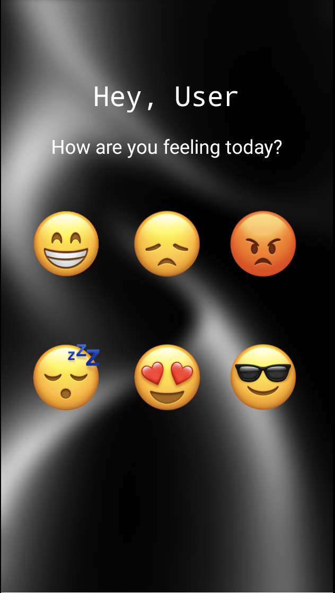
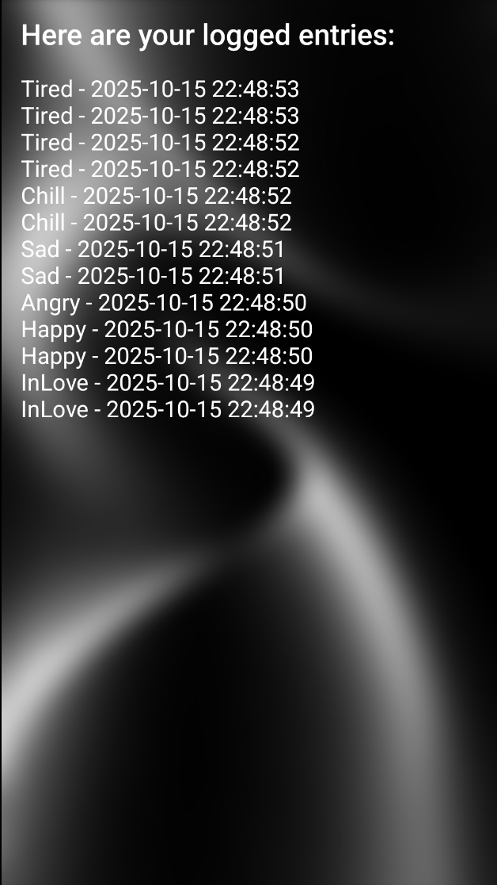
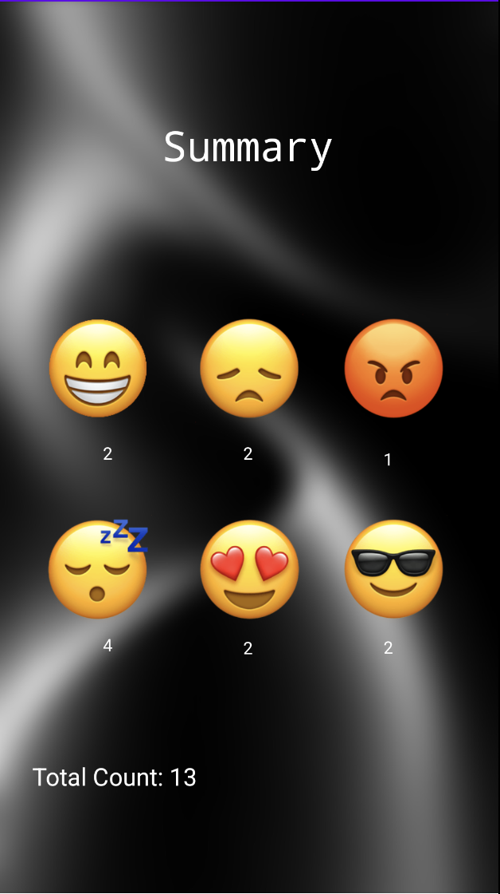
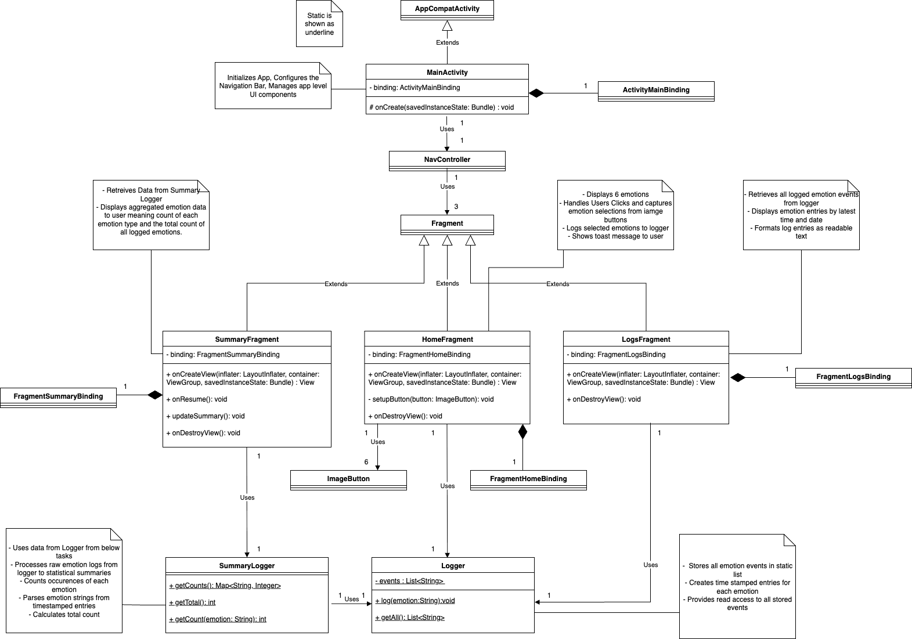

# EmotiLog 📱

<div align="center">
  
  
  **A simple and intuitive Android mood tracking app for daily emotional journaling**
  
  [](https://www.android.com/)
  [](https://www.java.com/)
  [](https://developer.android.com/studio)
</div>

## 📖 About

EmotiLog is a minimalist Android mood tracker designed for quick and easy daily emotional journaling. Users can tap emotion icons on the home screen to log their feelings with automatic timestamps. The app features a clean, intuitive interface with three main sections: Home for logging emotions, Logs for viewing all entries, and Summary for analyzing mood patterns.

Built for CMPUT 301

## ✨ Features

### 🏠 **Home Screen**
- **6 Emotion Icons**: Happy, Sad, Angry, Tired, In Love, and Chill
- **One-Tap Logging**: Simply tap an emotion to log it instantly
- **Automatic Timestamps**: Each entry is automatically timestamped
- **Visual Feedback**: Toast notifications confirm successful logging
- **Beautiful Background**: Custom background image for enhanced visual appeal

### 📋 **Logs Screen**
- **Complete History**: View all logged emotions in chronological order
- **Latest First**: Most recent entries appear at the top
- **Scrollable Interface**: Easy navigation through all entries
- **Clean Format**: "Emotion - YYYY-MM-DD HH:mm:ss" format

### 📊 **Summary Screen**
- **Individual Counts**: See how many times each emotion was logged
- **Total Count**: Track your overall logging activity
- **Visual Layout**: Emotion icons with their respective counts
- **Real-time Updates**: Summary updates automatically when you log emotions

## 🎨 Screenshots

| Home Screen | Logs Screen | Summary Screen |
|-------------|-------------|----------------|
|  |  |  |
| *Main interface where users tap emotion icons to log their current mood* | *Displays all logged emotions with timestamps in chronological order* | *Shows emotion counts and total logging activity* |

## 🛠️ Technical Details

### **Architecture**
- **Single Activity Architecture**: Uses one MainActivity with multiple fragments
- **Jetpack Navigation**: Bottom navigation between Home, Logs, and Summary
- **View Binding**: Modern Android UI binding approach
- **Material Design**: Follows Material Design guidelines

### **Key Components**
- **MainActivity**: Hosts navigation and manages fragments
- **Logger**: Static class for emotion logging and data management
- **SummaryLogger**: Handles emotion counting and statistics
- **HomeFragment**: Main emotion selection interface
- **LogsFragment**: Displays all logged entries
- **SummaryFragment**: Shows emotion statistics

### **Data Management**
- **In-Memory Storage**: Simple ArrayList-based storage
- **Automatic Timestamps**: Java SimpleDateFormat for consistent formatting
- **Real-time Updates**: Immediate UI updates on data changes

## 📱 Requirements

- **Android Version**: API 24+ (Android 7.0+)
- **Target SDK**: API 36
- **Java Version**: 11
- **Minimum RAM**: 2GB recommended
- **Storage**: < 50MB

## 🚀 Installation & Setup

### **Prerequisites**
- Android Studio Arctic Fox or later
- Android SDK API 24+
- Java 11 or later

### **Build Instructions**

1. **Clone the repository**
   ```bash
   git clone https://github.com/MuhammadZain2005/EmotiLog.git
   cd EmotiLog
   ```

2. **Open in Android Studio**
   - Launch Android Studio
   - Select "Open an existing project"
   - Navigate to `EmotiLog/code/EmotiLog/` folder
   - Click "OK"

3. **Sync Project**
   - Android Studio will automatically sync Gradle files
   - Wait for sync to complete

4. **Build and Run**
   - Connect an Android device or start an emulator
   - Click the "Run" button (▶️) or press `Shift + F10`
   - Select your target device
   - The app will install and launch automatically

### **Alternative: APK Installation**
If you have the APK file:
1. Enable "Unknown Sources" in your Android settings
2. Transfer the APK to your device
3. Tap the APK file to install

## 📁 Project Structure

```
EmotiLog/
├── code/
│   └── EmotiLog/                    # Android Project
│       ├── app/
│       │   ├── src/main/
│       │   │   ├── java/com/example/emotilog/
│       │   │   │   ├── MainActivity.java
│       │   │   │   ├── Logger.java
│       │   │   │   ├── SummaryLogger.java
│       │   │   │   └── ui/
│       │   │   │       ├── home/HomeFragment.java
│       │   │   │       ├── Logs/LogsFragment.java
│       │   │   │       └── summary/SummaryFragment.java
│       │   │   ├── res/
│       │   │   │   ├── drawable/          # Emotion icons
│       │   │   │   ├── layout/            # UI layouts
│       │   │   │   ├── values/            # Strings, colors
│       │   │   │   └── navigation/        # Navigation graph
│       │   │   └── AndroidManifest.xml
│       │   └── build.gradle.kts
│       └── build.gradle.kts
├── doc/
│   ├── Masad4-EmotiLogUML.drawio.png     # UML Diagram
│   └── Masad4-EmotiLogUML.drawio.pdf     # UML Diagram (PDF)
└── video/
    └── Demonstration.mov                  # App Demo Video
```

## 🎯 Usage

### **Logging Emotions**
1. Open the app
2. On the Home screen, tap any emotion icon that represents your current mood
3. You'll see a confirmation toast message
4. The emotion is automatically logged with the current timestamp

### **Viewing Logs**
1. Tap the "Logs" tab in the bottom navigation
2. Scroll through all your logged emotions
3. Entries are sorted with the most recent first

### **Checking Summary**
1. Tap the "Summary" tab in the bottom navigation
2. View individual counts for each emotion
3. See your total logging activity

## 🔧 Customization

### **Adding New Emotions**
1. Add emotion icon to `res/drawable/`
2. Update `strings.xml` with emotion name
3. Add ImageButton to `fragment_home.xml`
4. Update `HomeFragment.java` to handle new emotion
5. Update `SummaryFragment.java` to display count

### **Changing Colors**
- Modify `res/values/colors.xml`
- Update theme in `res/values/themes.xml`

### **Background Image**
- Replace `res/drawable/background_image.jpg`
- Maintain aspect ratio for best results

## 📊 UML Diagram

The project includes a comprehensive UML diagram showing the app's architecture and relationships between components.



## 🎥 Demo Video

Watch the app in action! Check out the demonstration video:
- **Location**: `EmotiLog/video/Demonstration.mov`
- **Content**: Complete app walkthrough showing all features

## 🤝 Contributing

Contributions are welcome! Here's how you can help:

1. **Fork the repository**
2. **Create a feature branch**: `git checkout -b feature/amazing-feature`
3. **Commit your changes**: `git commit -m 'Add amazing feature'`
4. **Push to the branch**: `git push origin feature/amazing-feature`
5. **Open a Pull Request**

### **Ideas for Contributions**
- Add data persistence (SQLite/Room)
- Implement emotion trends and charts
- Add export functionality
- Create backup/restore features
- Add dark mode support
- Implement emotion categories
- Add notes/comments to emotions

## 📝 License

This project is open source and available under the [MIT License](LICENSE).

## 👨‍💻 Author

**Muhammad Zain Asad**
- GitHub: [@MuhammadZain2005](https://github.com/MuhammadZain2005)
- Project: [EmotiLog Repository](https://github.com/MuhammadZain2005/EmotiLog)


---

<div align="center">
  <p>Made with ❤️ for better emotional awareness</p>
</div>